# personium-webdav-proxy

Auth proxy for personium Cell WebDAV.

## How to use

By below command, you can launch this script.

```bash
deno run --allow-net https://raw.githubusercontent.com/yoh1496/personium-webdav-proxy/main/index.ts <CELL_FQDN> <CELL_USERNAME> <CELL_PASSWORD>
```

|Name|Value|Example|
|:--|:--|:--|
|`<CELL_FQDN>` | Cell FQDN to access | `cell001.pds.example.com` |
|`<CELL_USERNAME>` | Username with which the client access to cell | `myAccount` |
|`<CELL_PASSWORD>` | Password with which the client access to cell | `Pa$$w0rd` |

And then, configure your WebDAV application to open `http://localhost:8000/<BOX_NAME>` to access the Box in Personium Cell.

## How it works



WebDAV application usually does not contain an authentication method which passes `Bearer` token in Authorization header.

This software (script) proxies requests from WebDAV application to Box in Personium Cell with adding `Bearer` token in Authorization header.